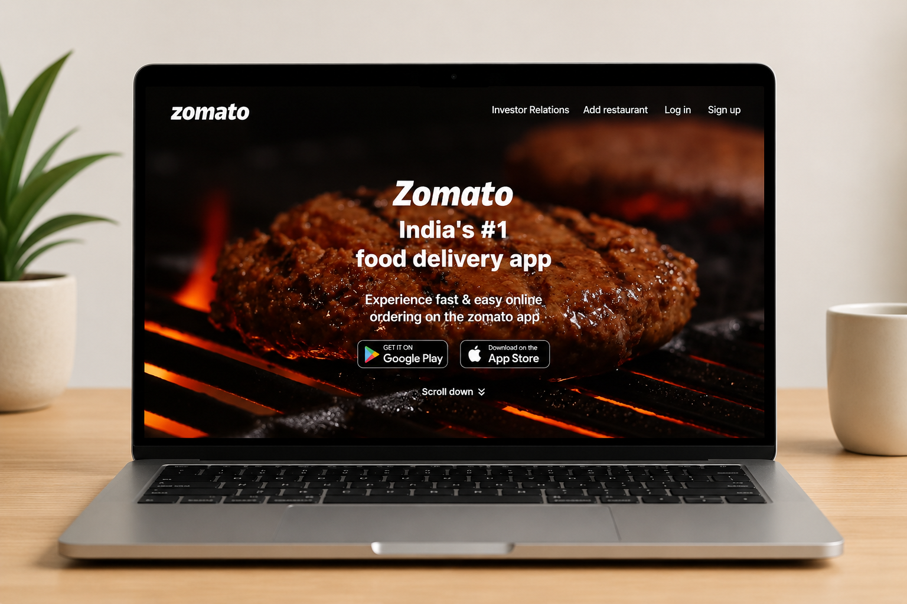

# 🍽️ Zomato Homepage Clone

A modern and responsive **Zomato Homepage Clone** built using **HTML5** and **CSS3**. This project recreates the design and layout of the official Zomato homepage with a clean user interface.

  <a href="https://somasindhuja.github.io/zomato/">
    <strong>🌐 Live Demo</strong>
  </a>

---

# 📸 Project Preview

  

---

# 📖 About the Project

This project is a front-end recreation of the **Zomato Homepage** using **HTML5** and **CSS3**. It focuses on creating a visually appealing homepage with a clean layout, modern styling, and an engaging user experience while strengthening core front-end development skills.

---

# ✨ Features

- 🎥 Hero Section with Background Video
- 🧭 Navigation Bar
- 📍 Location & Restaurant Search Bar
- 🍽️ Collections Section
- 🌟 Explore Section
- 📱 Get the App Section
- 🏢 Footer Section
- 🎨 Modern UI Design
- ✨ CSS Hover Effects

---

# 🛠️ Technologies Used

- **HTML5** – Page Structure
- **CSS3** – Styling and Visual Design
- **Flexbox** – Layout Alignment

---

# 🎯 Learning Outcomes

Through this project, I improved my skills in:

- Semantic HTML5
- CSS3 Styling
- Flexbox Layout
- Background Video Integration
- UI Design Principles
- Hover Effects
- Project Structure Organization

---

# 🚀 Future Enhancements

- Improve Mobile Responsiveness
- Add JavaScript Interactivity
- Add Smooth Animations
- Enhance Accessibility

---

# 👩‍💻 Author

**Sindhuja Soma**

- GitHub: https://github.com/somasindhuja

---

### ⭐ If you found this project useful, consider giving it a Star!

Thank you for visiting my repository.

